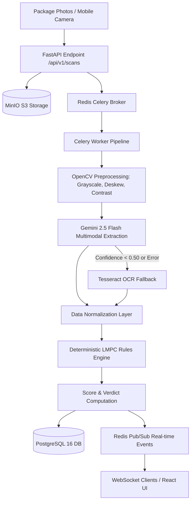

# LegalMetro Shield — Comprehensive System Architecture

**Project:** Software System to check compliance of Packaged Commodities under Legal Metrology (Packaged Commodities) Rules, 2011 (Problem Statement ID 26034)  
**Authority:** Department of Consumer Affairs (DoCA), Ministry of Consumer Affairs, Food & Public Distribution, Government of India  
**Specification Reference:** Canonical Spec §1 — §14  

---

## 1. Executive Summary & Core Principle

The Legal Metrology (Packaged Commodities) Rules, 2011 (LMPC Rules) mandate specific statutory declarations on all pre-packaged commodities sold in India — including manufacturer identity, net quantity with standard metric units, maximum retail price (MRP) inclusive of all taxes, consumer care coordinates, date of manufacture/packing, and country of origin.

### The Guiding Architectural Principle: "LLM Extracts, Code Judges"
A foundational tenet of LegalMetro Shield is that **probabilistic models never make legal judgments**:
1. **Multimodal LLM (Google Gemini 2.5 Flash)** and **Computer Vision (OpenCV + Tesseract OCR)** act strictly as extraction engines to transcribe, parse, and normalize textual declarations from commodity packaging photos.
2. **Deterministic Python Rules Engine** evaluates statutory compliance against codified LMPC rules, producing exact legal citations, quantifiable violation weights, compliance scores, and final legal verdicts (`compliant`, `non_compliant`, `needs_review`).

---

## 2. High-Level System Topology

LegalMetro Shield is structured as a resilient, modular system with decoupled compute, storage, and presentation tiers:

| Component | Technology Stack | Responsibility |
|---|---|---|
| **Web Client & PWA** | React 18, Vite 5, TypeScript, Tailwind CSS, TanStack Query v5, Zustand | Responsive desktop & mobile field inspection portal; offline scan outbox with IndexedDB; camera capture. |
| **Edge Gateway / Ingress** | Nginx Alpine | TLS termination, Brotli/Gzip compression, OWASP security headers, reverse proxy, WebSocket upgrade. |
| **Application API** | FastAPI, Python 3.12, Pydantic v2 | High-performance asynchronous REST API, SlowAPI rate limiting, RFC 7807 problem details error handling. |
| **Worker Subsystem** | Celery 5.x, Redis 7 (Broker & Result Backend) | Asynchronous scan pipeline orchestration, heavy OCR processing, image normalization, report generation. |
| **Storage Engine** | MinIO / AWS S3 Compatible | Secure object storage for raw evidence photos, OpenCV-processed images, and generated PDF/DOCX reports. |
| **Relational Database** | PostgreSQL 16 Alpine, SQLAlchemy 2.0 Async, asyncpg | Relational storage for users, scans, products, violations, audit logs, and reports; Full-Text Search (TSVector). |
| **Document Generation** | WeasyPrint (Cairo/Pango), python-docx, Jinja2 | Generating official statutory inspection reports with Ashok Stambh emblem, evidence photos, and citations. |

---

## 3. Multimodal Extraction & Fallback Pipeline

The asynchronous worker pipeline processes scan requests through well-defined stages:

### Step A: Image Ingestion & Storage Validation
1. Images uploaded via `POST /api/v1/scans` are validated at the API boundary (JPEG, PNG, WebP only, max 10MB per file, max 6 images per scan).
2. Saved to MinIO with UUID-partitioned storage keys: `scans/{scan_id}/original_{idx}.{ext}`.
3. The Celery worker fetches raw bytes and executes a **secondary magic-byte re-verification** (`validate_image_bytes`) before passing buffers to OpenCV to prevent poisoned payloads in object storage.

### Step B: Computer Vision Preprocessing
Image preprocessing enhances OCR accuracy under challenging field lighting:
- **Grayscale Conversion**: Reduces dimensional noise.
- **Adaptive Contrast Enhancement**: Contrast Limited Adaptive Histogram Equalization (CLAHE).
- **Bilateral Filtering**: Noise reduction while preserving edge crispness of typography.
- **Deskewing**: MinAreaRect orientation correction.

### Step C: Multimodal Extraction (Gemini 2.5 Flash)
- Preprocessed images are passed to Google Gemini 2.5 Flash using structured output prompts.
- Extracts Rule 6(1) declarations:
  - `manufacturer_name`, `packer_name`, `importer_name` and respective addresses.
  - `generic_name` (commodity common identity).
  - `net_quantity` and declared units.
  - `mrp` and taxes declaration string.
  - `mfg_date`, `import_date`, `expiry_date`.
  - `consumer_care` (phone, email, postal address, contact person).
  - `country_of_origin`.
  - `sizes_dimensions` and font height estimates.

### Step D: Tesseract OCR Fallback
- If Gemini API call fails, times out, or yields average confidence $< 0.50$, the worker automatically invokes local **Tesseract OCR (v5)** with regex-based statutory pattern extractors.
- `pipeline_meta.fallback_used` is recorded and flagged in the inspection UI.

---

## 4. Deterministic Rules Engine Architecture

The compliance engine evaluates extracted fields using YAML-codified statutory rules matching the Legal Metrology (Packaged Commodities) Rules, 2011:

### Evaluated Rule Registry
- `LMPC-R6-1a`: Manufacturer/Packer name and complete physical address.
- `LMPC-R6-1b-name`: Generic or common commodity name presence.
- `LMPC-R6-1b-qty`: Net quantity presence.
- `LMPC-R6-1c`: Month and year of manufacture/packing.
- `LMPC-R6-1d`: Consumer care telephone, email, and address completeness.
- `LMPC-R6-1e`: Maximum Retail Price (MRP) presence.
- `LMPC-R6-1f`: Country of origin presence (mandatory for all commodities, critical for imports).
- `LMPC-R6-importer`: Importer name and address presence for imported goods.
- `LMPC-R9-1a`: MRP statutory formatting and currency symbol (`₹` or `Rs.`).
- `LMPC-R9-1b`: Statutory phrase "inclusive of all taxes" or "incl. of all taxes".
- `LMPC-R9-3`: Prohibition of Dual MRP stickers or divergent price markings.
- `LMPC-R9-5`: Principal Display Panel (PDP) font size validation against Rule 9(5) Table 1.
- `LMPC-R10-1`: Standard metric units (g, kg, ml, l) and prohibition of illegal plural symbols (`gms`, `kgs`).
- `LMPC-R10-2`: Prohibition of non-standard qualifying words (`approx`, `when packed`).
- `LMPC-R11-1`: Validity of packing date and prohibition of post-dated packaging.

### Scoring Algorithm
- Every rule has a configurable weight: `CRITICAL` (30 pts), `MAJOR` (15 pts), `MINOR` (5 pts).
- Penalties subtract from a base score of 100.
- **Verdict Logic**:
  - Score $\ge 85$ and 0 Critical violations: `compliant`.
  - Any Critical violation or Score $< 60$: `non_compliant`.
  - Score between $60$ and $84$, or low confidence extraction: `needs_review`.

---

## 5. Security & Threat Modeling (OWASP Pass)

### 5.1 Authentication & Token Architecture
- **Stateless Access Tokens**: Short-lived JWTs (30 minutes) containing `user_id`, `role`, and expiration.
- **Refresh Tokens with Family Rotation**:
  - Cryptographically random 64-character tokens stored as SHA-256 digests.
  - Linked to a `family_id` UUID.
  - Upon refresh, the previous token is marked revoked and a new child token is generated.
  - **Replay Attack Detection**: If an already-revoked refresh token is presented, the system revokes the entire token family and terminates all active sessions for that chain.
- **Bearer Header vs httpOnly Cookie Architectural Decision**:
  - LegalMetro Shield supports field enforcement officers using mobile PWA clients, offline IndexedDB synchronization, and cross-origin native mobile apps.
  - Utilizing `Authorization: Bearer <token>` eliminates CSRF attack vectors by design (browsers do not automatically attach Bearer headers).
  - Web client storage uses memory-backed state (Zustand) refreshed periodically. For environments requiring persistent browser cookies, the backend supports seamless middleware conversion.

### 5.2 Rate Limiting (SlowAPI)
- Defense against credential stuffing and DoS attacks:
  - `POST /api/v1/auth/login`: **5 requests / minute** per IP.
  - `POST /api/v1/auth/register`: **10 requests / minute** per IP.
  - `POST /api/v1/auth/refresh`: **10 requests / minute** per IP.
  - `POST /api/v1/scans`: **30 uploads / minute** per IP.
- Rate-limited responses return HTTP `429 Too Many Requests` formatted per **RFC 7807 Problem Details** with a `Retry-After: 60` header.

### 5.3 SSRF Defense & URL Sanitization
- For e-commerce packaging inspection (`POST /api/v1/scans/url`), the backend validates URLs against a strict whitelist of public FQDNs, disallowing `localhost`, `127.0.0.1`, AWS metadata (`169.254.169.254`), and private RFC 1918 subnets (`10.0.0.0/8`, `172.16.0.0/12`, `192.168.0.0/16`).

### 5.4 Storage Access Control & Presigned URLs
- MinIO buckets are private by default.
- Evidence photos and generated inspection notices are delivered through **time-limited presigned URLs (5-minute expiry)**.
- `GET /api/v1/reports/{id}/download` verifies caller RBAC permissions and ownership before generating presigned URLs.

---

## 6. Progressive Web App (PWA) & Offline Sync

Inspectors frequently audit remote warehouses, mandis, and retail stores with degraded 2G/3G connectivity.

1. **Service Worker Caching**:
   - `vite-plugin-pwa` precaches app shell, stylesheets, web fonts, and Lucide icons.
   - Cache-first strategy for static assets and network-first for inspection queries.
2. **IndexedDB Outbox (`LegalMetroOutboxDB`)**:
   - When offline (`navigator.onLine === false`), the scan submission automatically serializes captured images and metadata into IndexedDB.
   - Live banner notifies the officer: *"Offline Mode: Scan queued locally. Auto-sync will trigger once connection resumes."*
3. **Automatic Synchronization**:
   - Window `online` event listener detects connectivity restoration, automatically drains the outbox queue, uploads pending scans via multipart API, and prompts a toast notification with the generated Scan ID.

---

## 7. Report Generation Engine

- **WeasyPrint PDF Generator**:
  - Jinja2 template (`gov-report.html`) formatted per Official Gazette standards.
  - Header: Ashok Stambh National Emblem, DoCA ministry title, inspection date, unique verification barcode.
  - Photos: Product packaging photos from MinIO base64-embedded directly to ensure zero external network calls during rendering.
  - Declarations audit table, statutory citations, non-compliance penalties, and inspecting officer signature block.
  - Compliant with `@page { size: A4 portrait; margin: 15mm; }`.
- **python-docx Generator**:
  - Generates editable `.docx` legal notices with identical hierarchical sections for departmental filing and court submissions.
